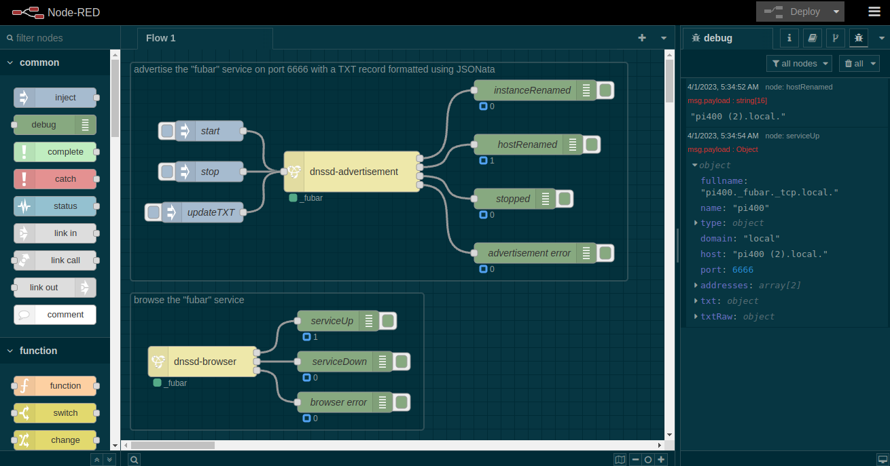

# @parasaurolophus/node-red-dnssd

Wrap
[@gravitysoftware/dnssd](https://www.npmjs.com/package/@gravitysoftware/dnssd)
for use in [Node-RED](https://nodered.org).



This provides a superset of the functionality supported by
[node-red-node-discovery](https://flows.nodered.org/node/node-red-node-discovery),
without generating any warnings in the Node-RED log.

---

## dnssd-advertisement

### Input

`msg.payload.command` specifies a `dnssd.Advertisement` method to invoke:

#### `start`

Start responding to service enquiries from [browsers](#dnssd-browser).

```json
{ "payload": {
        "command": "start"
        [, "service": name]
        [, "udp": boolean]
        [, "port": number]
        [, "options": json]
    }
}
```

If the optional `service` name, `udp`, `port` number or `options` values are
provided, they will override the node's configuration.

#### `stop`

Broadcast a "service down" event.

```json
{ "payload": { "command": "stop" } }
```

#### `updateTXT`

Update the `TXT` record. (Note that this is provided for completeness but is of
limited utility since it does not trigger any of the events exposed by the
`dnssd.Browser` object.)

```json
{
    "payload": {
        "command": "updateTXT",
        "txt": {
            "foo": "bar"
        }
    }
}
```

### Outputs

1. Stream of `Advertiser.instanceRenamed()` events 
2. Stream of `Advertiser.hostRenamed()` events
3. Stream of `Advertiser.stopped()` events
3. Stream of `Advertiser.error()` events

---

## dnssd-browser

### Input

`msg.payload.command` specifies a `dnssd.Browser` method to invoke:

#### `start`

Begin listening for service life-cycle events.

```json
{
    "payload": {
            "command": "start"
            [, "service": name]
            [, "udp": boolean]
    }
}
```

If the optional `service` name or `udp` values are provided, they will override the node's configured values.

#### `stop`

Stop listening for service life-cycle events.

```json
{ "payload": {  "command": "stop" } }
```

#### `list`

Send a list of running services.

```json
{ "payload": {  "command": "list" } }
```

### Outputs

1. Stream of `Browser.serviceUp()` events
2. Stream of `Browser.serviceDown()` events
3. Stream of `Browser.error()` events
4. `Browser.list()` results

---

## Details

This is a deliberately thin wrapper around the functionality exposed by
[@gravitysoftware/dnssd](https://www.npmjs.com/package/@gravitysoftware/dnssd),
which is a pure JavaScript implementation of [DNS-SD](http://www.dns-sd.org/).

The _Service_ configuration string is the name of the DNS-SD service to
broadcast using `dnssd-advertisement` or watch using `dnssd-browser`.

By default, these nodes will use TCP. The _Use UDP?_ configuration checkbox
tells them to use UDP instead.

`dnssd-advertisement` also requires a _Port_ number and can optionally take
_Options_, including a `txt` record. _Options_ may be specified using JSON or
JSONata.

These nodes do not start automatically even if they are fully configured. Use
`inject` nodes configured to send messages when flows are (re-) started if
required for your purposes.
